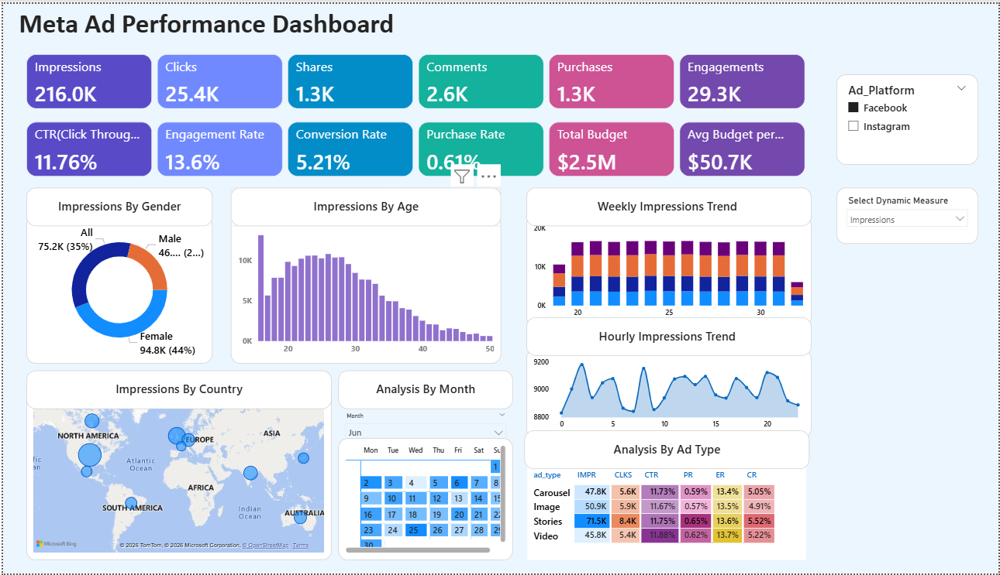
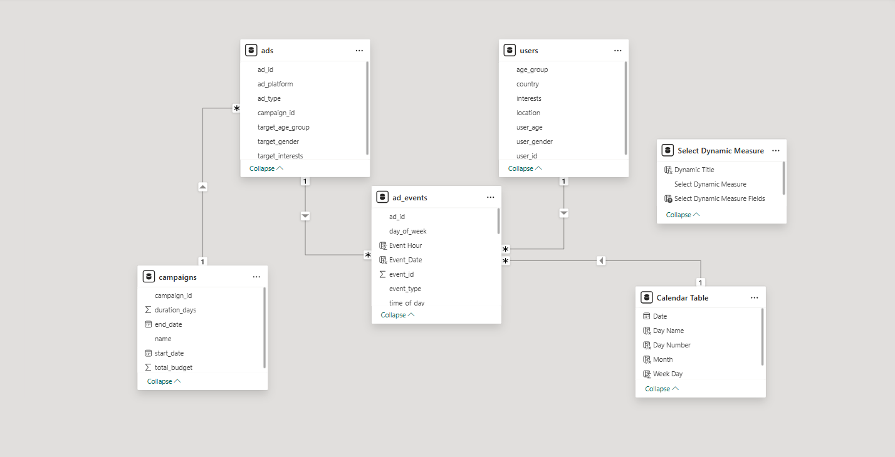

# Meta Ads Performance Analytics Dashboard

## Executive Summary

Built an end-to-end marketing analytics dashboard in Power BI to evaluate digital ad campaign performance and optimize advertising spend.

The project transforms raw event-level ad interaction data into executive-level KPIs, enabling performance comparison across campaigns, ads, and user segments.

This dashboard answers one core business question:

**Where is marketing money generating real return — and where is it being wasted?**

---

## Project Highlights

- Designed a relational data model integrating four structured datasets  
- Engineered 8+ dynamic DAX measures for performance analysis  
- Built interactive KPI dashboards for campaign and ad-level insights  
- Identified opportunities for marketing spend optimization  

---

## Business Objective

Digital campaigns generate large volumes of impressions and clicks, but decision-makers care about profitability and efficiency.

This project focuses on:

- Measuring campaign efficiency  
- Identifying high-ROI ads  
- Detecting budget leakage  
- Understanding conversion behavior  
- Supporting data-driven ad spend optimization  

---

## Data Architecture & Modeling

The solution integrates four structured datasets:

- `campaigns.csv`  
- `ads.csv`  
- `ad_events.csv`  
- `users.csv`

A relational data model was built in Power BI, connecting event-level interaction data to campaign and user dimensions.

### Modeling Elements

- Fact table: `ad_events`  
- Dimension tables: campaigns, ads, users  
- Proper relationship cardinality  
- Cleaned and transformed data before modeling  

This structure ensures accurate aggregation, filtering, and drill-down analysis.

---

## KPI Engineering (DAX-Driven Metrics)

Custom DAX measures were created to dynamically calculate:

- Total Impressions  
- Total Clicks  
- Total Conversions  
- Click-Through Rate (CTR)  
- Cost Per Click (CPC)  
- Conversion Rate  
- Return on Investment (ROI)  
- Total Spend  

Measures were built using context-aware logic to ensure accuracy under slicers and filters.

---

## Metric Definitions

- **CTR (Click-Through Rate):** Clicks / Impressions  
- **CPC (Cost Per Click):** Total Spend / Clicks  
- **Conversion Rate:** Conversions / Clicks  
- **ROI (Return on Investment):** (Revenue − Spend) / Spend  

---

## Dashboard Capabilities

The dashboard includes:

- Executive KPI summary view  
- Campaign-level ROI comparison  
- Ad-level performance breakdown  
- Conversion funnel analysis  
- Interactive slicers for segmentation  
- Drill-down analysis  

This enables rapid identification of:

- Top-performing campaigns  
- Underperforming ads consuming budget  
- High-engagement but low-conversion segments  
- Cost optimization opportunities  

---

## Key Analytical Insights

- High CTR does not necessarily translate into high ROI.  
- A small subset of ads drives the majority of conversions.  
- Budget inefficiencies are visible through CPC and conversion rate patterns.  
- Campaign performance varies across user segments.

These insights support strategic reallocation of advertising budgets.

---

## Tools & Technologies

- Power BI Desktop  
- DAX (Data Analysis Expressions)  
- Relational Data Modeling  
- CSV Data Integration  

---

## Skills Demonstrated

- Marketing Analytics  
- KPIs & Business Metric Engineering  
- Relational Data Modeling  
- DAX Measure Development  
- Dashboard Design & Data Storytelling  

---

## Future Enhancements

- Time-based performance trend analysis  
- Campaign ROI forecasting  
- Cohort-based user segmentation  
- A/B testing comparisons  
- Publishing to Power BI Service for wider stakeholder access  

---

## How to Run

1. Download the `.pbix` file.  
2. Open in Power BI Desktop.  
3. Ensure your CSV files are placed in the correct folder and properly linked.  
4. Refresh the model if required.  

## 📊 Dashboard Preview

---

## 🗂️ Data Model (ER Diagram)

